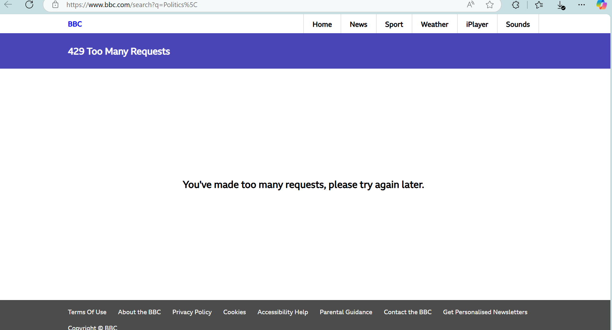

# BusPatrol-Assignment

### Below libraries to be installed

- node.js [https://nodejs.org/en/download/package-manager]
- playwright (install typescript) [https://www.npmjs.com/package/playwright]
- cucumber [https://www.npmjs.com/package/@cucumber/cucumber]
- cucumber plugin in vscode [https://marketplace.visualstudio.com/items?itemName=CucumberOpen.cucumber-official]
- allure [https://www.npmjs.com/package/allure]
<!-- - multiple cucumber html reporter [https://github.com/WasiqB/multiple-cucumber-html-reporter] -->
- ts-node [https://www.npmjs.com/package/node-ts]
- k6 Grafana [https://grafana.com/docs/k6/latest/set-up/install-k6/]
- k6 Grafana node package [https://www.npmjs.com/package/k6]
- xk6 - [https://k6.io/blog/extending-k6-with-xk6/]
### Actions Points Covered

1. Added the **functional_tests** and **performance_tests** test cases.
2. Implemented in **Page Object Model** and **Behavioral-Driven**.
3. Implemented **Singleton class** file to serve single instance at at time.
4. Handled the **parallel** execution.
5. configured **gitHub Actions yaml** with artifacts publish feature.
6. **Reports** and **traces** generated and published in pipeline.
7. Custom **logging** and **Error handling** were implemented.
8. Implemented the feature to run test in **browserstack** and **lambdatest**.

