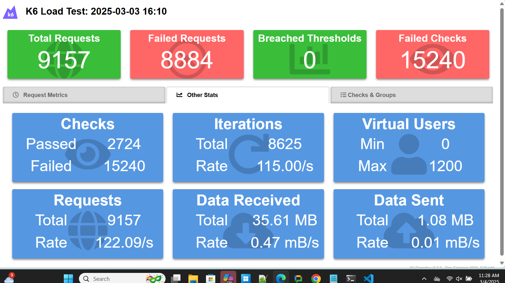
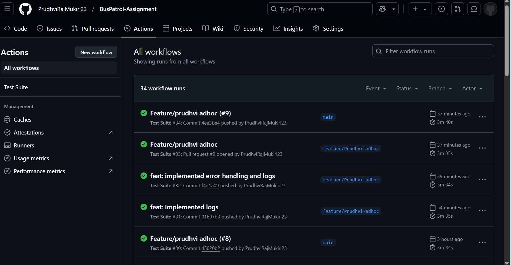

# BusPatrol-Assignment

### Actions Points Covered
1. Added the **functional_tests** and **performance_tests** test cases.
2. Implemented in **Page Object Model**, **Modular approach** and **Behavioral Driven Development**.
3. Handled the **parallel** execution.
4. configured **gitHub Actions yaml** with artifacts publish feature.
5. **Reports** and **traces** generated and published in pipeline.
6. Custom **logging** and **Error handling** were implemented.

## Functional Tests

- **Playwright** is an open-source automation framework developed by Microsoft for testing and interacting with web applications.
- I have used **Playwright** along with **Cucumber** to achieve behaviour-driven development (BDD).
- I have used shell script to execute the functional tests.

- _**Note: One of the usecase url i.e.,[https://marksheet.io/html-forms.html](https://marksheet.io/html-forms.html) is not as expected. It is not having required signup form. So I have changes the usecase according to the new url changes.**_


#### Functional Tests Directory Structure 

```
BusPatrol-Assignment/
├── functional_tests/
│   ├── src/                        # Contains source code related to functional tests
│   │   ├── pages/                  # Contains page objects (Page Object Model pattern)
│   │   ├── playwright_actions/     # Contains Playwright actions like interactions and asserts of elements
│   │   └── xpaths/                 # Contains XPath selectors for locating elements
│   ├── tests/                      # Contains test cases and test scripts
│   │   ├── features/               # Contains feature files with Gherkin languages
│   │   ├── hooks/                  # Contains hooks from cucumber for browser, traces and screenshots setups
│   │   └── step_def/               # Contains step definitions to implement the actions described in the feature files
│   └── utils/                      # Contains utility functions for functional testing
```

## Execution of functional tests in WSL

- Pre-setup: 
    1. Install WSL
    2. Install Playwright in WSL

### Steps to run in WSL:
- Navigate to root folder level in local
- Set env values of __channel=chrome or msedge__ & __headless=true or false__ in **.env** file in root level
- Open WSL in terminal in root level

- Execute below command: 
```bash

    npm i # to install all dependencies required

    bash run_ui.sh # to run the ui test cases

```

## Execution of functional tests in Windows

- Prerequisite: 
    I. Install Playwright in Windows

### Steps to run in WSL:
- Navigate to root folder level in local
- Set env values of __channel=chrome or msedge__ & __headless=true or false__ in **.env** file in root level

- Execute below command: 
```bash

    npm i # to install all dependencies required

    npm run_ui_tests # to run functional test cases

    npm rerun_ui_tests # to rerun failed test cases

```
- Note: By running ui test cases, by default the report get generated in below path:

```
BusPatrol-Assignment/
├── test-results/
│   ├── json-reports/    # Contains index.html file report
```

## Reports of functional tests

- After running test cases in **test-results**, .json file will be generated. Based on that we will generate the cucumber html report.
- **index.html** folder shown in below path is the report file
- Run below command in wsl/windows to generate report.

```
BusPatrol-Assignment/
├── test-results/
│   ├── json-reports/    # Contains index.html file report
```

```bash
    npm run_ui_report_gen # to generate the index.html file based on functional-tests-report in test-results folder
```


## Performance Tests

- **K6** (from Grafana) is an open-source load testing tool designed for testing the performance and scalability of applications.
- I have used **K6 library** from Grafana for testing end points performance in web application.
- I have used the shell script to execute the performance tests by setting up required env values.

#### Performance Tests Directory Structure 
```
BusPatrol-Assignment/
├── performance_tests/
│   ├── tests/            # Contains tests related performance test
│   └── utils/            # Contains utility functions for performance testing
```

## Execution of performance tests in WSL

- Pre setup: 
    1. Install WSL
    2. Install K6 in WSL
    3. Install Playwright in WSL

### Steps to run:
- Navigate to root folder level in local
- Open WSL in terminal
- Execute below command: 

```bash

    bash run_k6.sh

```
- Note: __search_and_navigate__ test cases is mostly failing because the bbc website is not withstanding for too many requests as shown in below screenshot:


## Reports of performance tests

- After running test cases reports will be generated in **performance-reports** folder.

```
BusPatrol-Assignment/
├── performance-reports/     # Contains performance test html file reports
```





## CI/CD Implementation

#### GitHum Actions

- I have integrated the github action pipeline also. pipeline.yml is provided under './github/workflows' path. 
- I have published the artifactes that contains traces and reports reports in pipleline.




## References libraries / links

- node.js [https://nodejs.org/en/download/package-manager]
- playwright (install typescript) [https://www.npmjs.com/package/playwright]
- cucumber [https://www.npmjs.com/package/@cucumber/cucumber]
- cucumber plugin in vscode [https://marketplace.visualstudio.com/items?itemName=CucumberOpen.cucumber-official]
- ts-node [https://www.npmjs.com/package/ts-node]
- k6 Grafana [https://grafana.com/docs/k6/latest/set-up/install-k6/]
- k6 Grafana node package [https://www.npmjs.com/package/k6]
- cucumber-js [https://github.com/cucumber/cucumber-js/blob/main/docs/configuration.md]
- winston logger [https://www.npmjs.com/package/winston]
- multiple cucumber html reporter [https://github.com/WasiqB/multiple-cucumber-html-reporter]